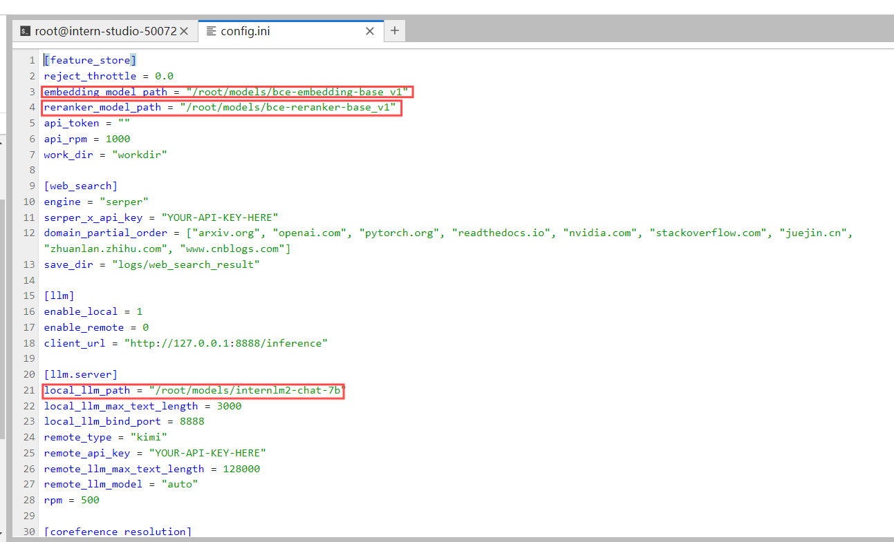
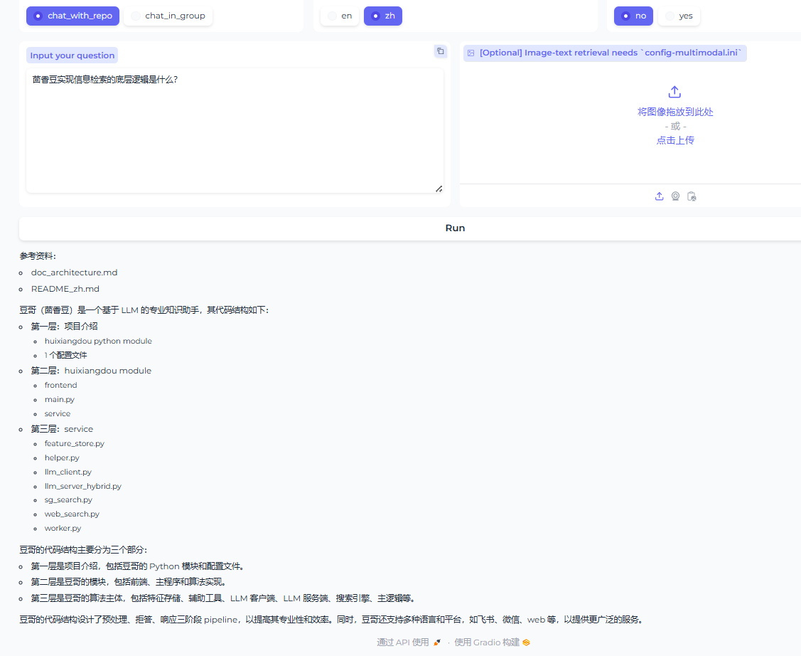
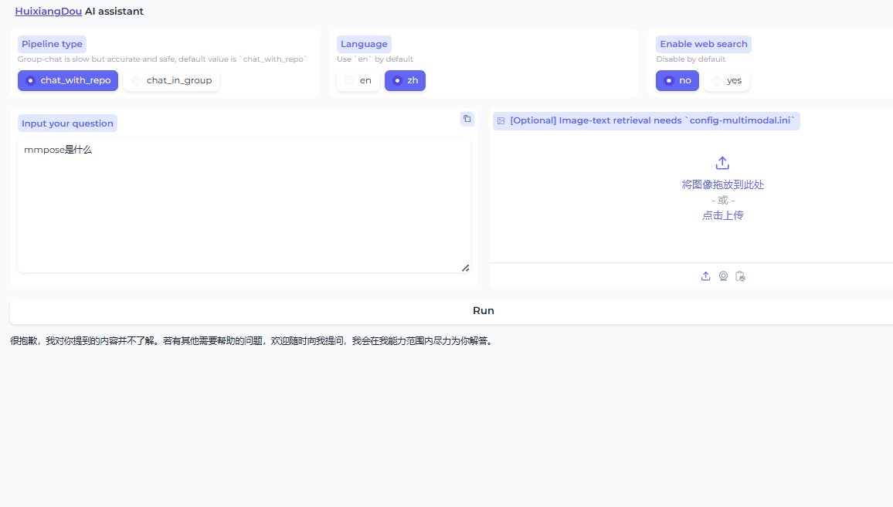

# 茴香豆 task

### 任务

在 InternStudio 中利用 Internlm2-7b 搭建标准版茴香豆知识助手，并使用 Gradio 界面完成 2 轮问答

- 按照要求创建好开发机后，创建茴香豆专用 conda 环境并激活

```bash
studio-conda -o internlm-base -t huixiangdou

conda activate huixiangdou
```

- 下载茴香豆

将茴香豆代码仓库拉取到开发机

```bash
cd /root
# 克隆代码仓库
git clone https://github.com/internlm/huixiangdou && cd huixiangdou
git checkout 79fa810
```

- 安装茴香豆所需依赖

```bash
conda activate huixiangdou
# parsing `word` format requirements
apt update
apt install python-dev libxml2-dev libxslt1-dev antiword unrtf poppler-utils pstotext tesseract-ocr flac ffmpeg lame libmad0 libsox-fmt-mp3 sox libjpeg-dev swig libpulse-dev
# python requirements
pip install BCEmbedding==0.1.5 cmake==3.30.2 lit==18.1.8 sentencepiece==0.2.0 protobuf==5.27.3 accelerate==0.33.0
pip install -r requirements.txt
# python3.8 安装 faiss-gpu 而不是 faiss
```

- 下载模型文件

茴香豆默认会根据配置文件自动下载对应的模型文件，为了节省时间，本次教程所需的模型已经提前下载到服务器中，我们只需要为本次教程所需的模型建立软连接，然后在配置文件中设置相应路径就可以：

```bash
# 创建模型文件夹
cd /root && mkdir models

# 复制BCE模型
ln -s /root/share/new_models/maidalun1020/bce-embedding-base_v1 /root/models/bce-embedding-base_v1
ln -s /root/share/new_models/maidalun1020/bce-reranker-base_v1 /root/models/bce-reranker-base_v1

# 复制大模型参数（下面的模型，根据作业进度和任务进行**选择一个**就行）
ln -s /root/share/new_models/Shanghai_AI_Laboratory/internlm2-chat-7b /root/models/internlm2-chat-7b
```

- 更改配置文件

进入茴香豆配置文件`/root/huixiangdou/config.ini`



- 知识库创建

在 huixiangdou 文件加下创建 repodir 文件夹，用来储存知识库原始文档。再创建一个文件夹 workdir 用来存放原始文档特征提取到的向量知识库。

```bash
conda activate huixiangdou

cd /root/huixiangdou && mkdir repodir

git clone https://github.com/internlm/huixiangdou --depth=1 repodir/huixiangdou
git clone https://github.com/open-mmlab/mmpose    --depth=1 repodir/mmpose

# Save the features of repodir to workdir, and update the positive and negative example thresholds into `config.ini`
mkdir workdir
python3 -m huixiangdou.service.feature_store
```

准备好后启动`python3 -m huixiangdou.service.feature_store` 命令进行向量知识库的创建和应答阈值的更新。

- 启动Gradio demo

在终端输入以下命令移动gradio web demo

```bash
conda activate huixiangdou
cd /root/huixiangdou
python3 -m huixiangdou.gradio
```





### 写在最后

**感谢第三期书生·浦语大模型实战营的开展**

**感谢书生全链路体系开源，提供数据集、模型微调框架、测评体系、部署框架**

**感谢InternStudio提供的算力支持**

**感谢助教和实战应同学的答疑解惑**