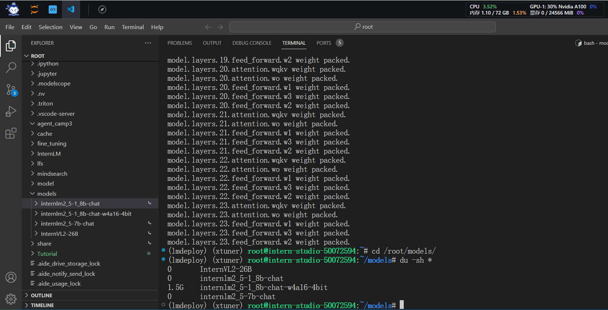
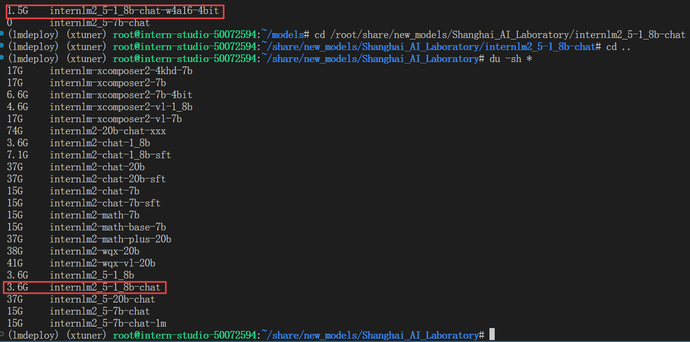
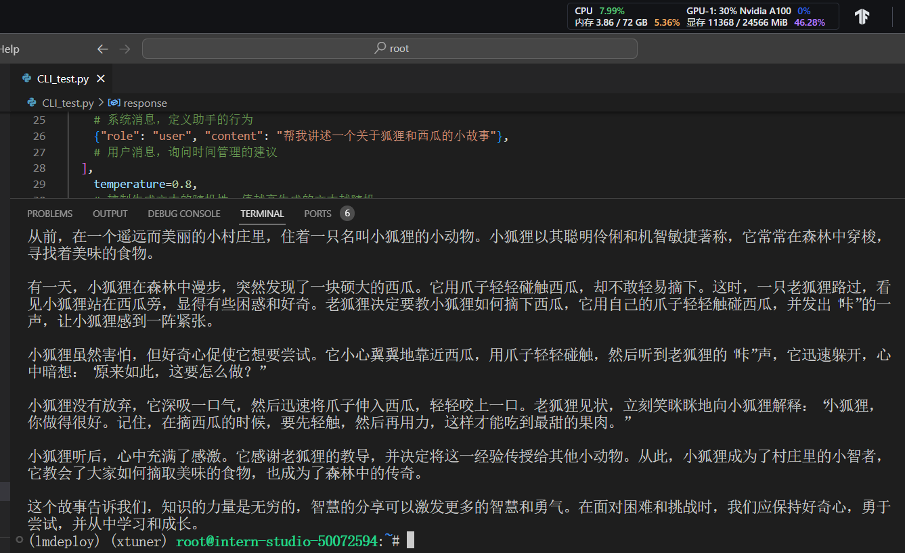
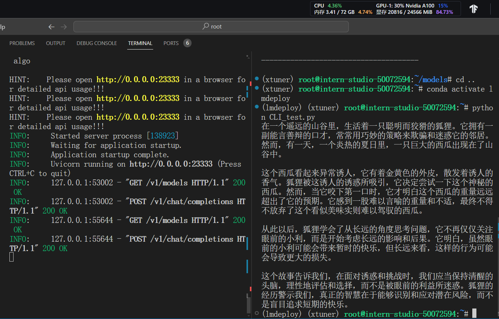

# LMDeploy task

### 任务

- 使用结合W4A16量化与kv cache量化的internlm2_5-1_8b-chat模型封装本地API并与大模型进行一次对话

#### 量化部署

>### W4A16 模型量化

>W4：这通常表示权重量化为4位整数（int4）。这意味着模型中的权重参数将从它们原始的浮点表示（例如FP32、BF16或FP16，Internlm2.5精度为BF16）转换为4位的整数表示。这样做可以显著减少模型的大小。
>A16：这表示激活（或输入/输出）仍然保持在16位浮点数（例如FP16或BF16）。激活是在神经网络中传播的数据，通常在每层运算之后产生。

>因此，W4A16的量化配置意味着：
>权重被量化为4位整数。
>激活保持为16位浮点数。

- 首先从share盘中将要量化的模型软连接到`/root/models/internlm2_5-1_8b-chat`中

```bash
ln -s /root/share/new_models/Shanghai_AI_Laboratory/internlm2_5-1_8b-chat /root/models
```

- 创建lmdeploy虚拟环境
  
  ```bash
    conda create -n lmdeploy  python=3.10 -y
    conda activate lmdeploy
    conda install pytorch==2.1.2 torchvision==0.16.2 torchaudio==2.1.2 pytorch-cuda=12.1 -c pytorch -c nvidia -y
    pip install timm==1.0.8 openai==1.40.3 lmdeploy[all]==0.5.3
  ```

- 启动W4A16量化

```bash
lmdeploy lite auto_awq \
   /root/models/internlm2_5-1_8b-chat \
  --calib-dataset 'ptb' \
  --calib-samples 128 \
  --calib-seqlen 2048 \
  --w-bits 4 \
  --w-group-size 128 \
  --batch-size 1 \
  --search-scale False \
  --work-dir /root/models/internlm2_5-1_8b-chat-w4a16-4bit
```

命令解释：

1.lmdeploy lite auto_awq: lite这是LMDeploy的命令，用于启动量化过程，而auto_awq代表自动权重量化（auto-weight-quantization）。

2./root/models/internlm2_5-7b-chat: 模型文件的路径。

3.--calib-dataset 'ptb': 这个参数指定了一个校准数据集，这里使用的是’ptb’（Penn Treebank，一个常用的语言模型数据集）。

4.--calib-samples 128: 这指定了用于校准的样本数量—128个样本

5.--calib-seqlen 2048: 这指定了校准过程中使用的序列长度—2048

6.--w-bits 4: 这表示权重（weights）的位数将被量化为4位。

7.--work-dir /root/models/internlm2_5-7b-chat-w4a16-4bit: 这是工作目录的路径，用于存储量化后的模型和中间结果。

W4A16量化完成





与原模型相比W4A16量化节省了一半还多的空间

### kv cache量化

> kv cache是一种缓存技术，通过存储键值对的形式来复用计算结果，以达到提高性能和降低内存消耗的目的。在大规模训练和推理中，kv cache可以显著减少重复计算量，从而提升模型的推理速度。理想情况下，kv cache全部存储于显存，以加快访存速度。

> 模型在运行时，占用的显存可大致分为三部分：模型参数本身占用的显存、kv cache占用的显存，以及中间运算结果占用的显存。LMDeploy的kv cache管理器可以通过设置--cache-max-entry-count参数，控制kv缓存占用剩余显存的最大比例。默认的比例为0.8。

### W4A16量化与kv cache量化的internlm2_5-1_8b-chat模型封装本地API并对话

- 使用以下命令执行操作,启动本地API

```bash
lmdeploy serve api_server \
    /root/models/internlm2_5-1_8b-chat-w4a16-4bit \
    --model-format awq \
    --cache-max-entry-count 0.4 \
    --quant-policy 4 \
    --server-name 0.0.0.0 \
    --server-port 23333 \
    --tp 1
```

- 新建终端创建CLI_test文件测试模型显存占用情况并于模型对话

```bash
touch /root/CLI_test.py
```

将下面的代码粘贴进`CLI_test.py`中

```bash
# 导入openai模块中的OpenAI类，这个类用于与OpenAI API进行交互
from openai import OpenAI


# 创建一个OpenAI的客户端实例，需要传入API密钥和API的基础URL
client = OpenAI(
    api_key='YOUR_API_KEY',  
    # 替换为你的OpenAI API密钥，由于我们使用的本地API，无需密钥，任意填写即可
    base_url="http://0.0.0.0:23333/v1"  
    # 指定API的基础URL，这里使用了本地地址和端口
)

# 调用client.models.list()方法获取所有可用的模型，并选择第一个模型的ID
# models.list()返回一个模型列表，每个模型都有一个id属性
model_name = client.models.list().data[0].id

# 使用client.chat.completions.create()方法创建一个聊天补全请求
# 这个方法需要传入多个参数来指定请求的细节
response = client.chat.completions.create(
  model=model_name,  
  # 指定要使用的模型ID
  messages=[  
  # 定义消息列表，列表中的每个字典代表一个消息
    {"role": "system", "content": "你是一个友好的小助手，负责解决问题."},  
    # 系统消息，定义助手的行为
    {"role": "user", "content": "帮我讲述一个关于狐狸和西瓜的小故事"},  
    # 用户消息，询问时间管理的建议
  ],
    temperature=0.8,  
    # 控制生成文本的随机性，值越高生成的文本越随机
    top_p=0.8  
    # 控制生成文本的多样性，值越高生成的文本越多样
)

# 打印出API的响应结果
print(response.choices[0].message.content)
```

激活环境并执行python代码

```bash
conda activate lmdeploy
python CLI_test.py
```





上图使用W4A16与kv cache量化后internlm2_5-1.8b-chat模型封装本地API对话和不使用量化的模型相对比，现存占比减少了将近一半。真的顶！

