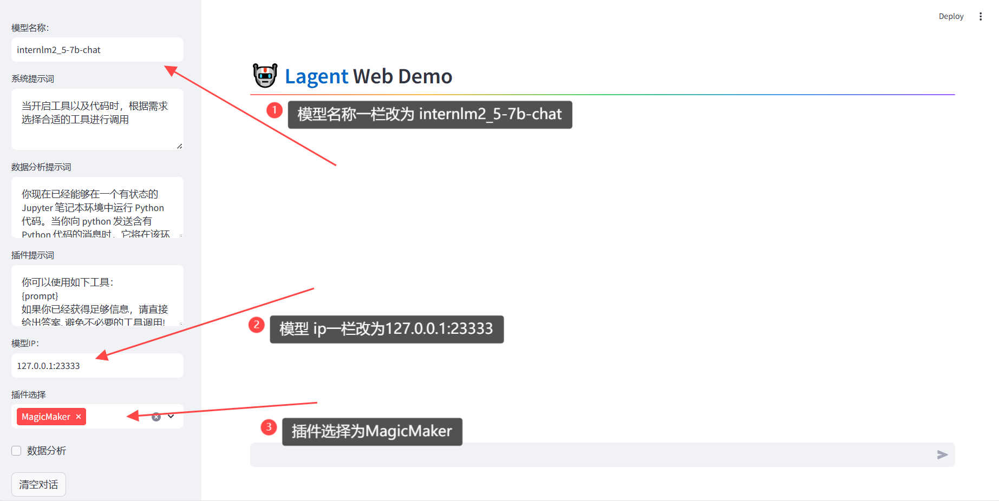

# Lagent task


### Lagent Kit
有关Lagent工具参考[官方地址](https://lagent.readthedocs.io/zh-cn/latest/tutorials/action.html)

### 任务

***创建自己的智能体***

### 使用Lagent实现文生图

创建开发机并下载好相关依赖后实现调用 MagicMaker API 以完成文生图的功能

使用以下代码下载Lagent源码

```bash
# 创建目录以存放代码
mkdir -p /root/agent_camp3
cd /root/agent_camp3
git clone https://github.com/InternLM/lagent.git
cd lagent && git checkout 81e7ace && pip install -e . && cd ..
```

创建工具文件

```bash
cd /root/agent_camp3/lagent
touch lagent/actions/magicmaker.py
```

将以下代码复制进`/root/agent_camp3/lagent/lagent/actions/magicmaker.py`

```python
import json
import requests

from lagent.actions.base_action import BaseAction, tool_api
from lagent.actions.parser import BaseParser, JsonParser
from lagent.schema import ActionReturn, ActionStatusCode


class MagicMaker(BaseAction):
    styles_option = [
        'dongman',  # 动漫
        'guofeng',  # 国风
        'xieshi',   # 写实
        'youhua',   # 油画
        'manghe',   # 盲盒
    ]
    aspect_ratio_options = [
        '16:9', '4:3', '3:2', '1:1',
        '2:3', '3:4', '9:16'
    ]

    def __init__(self,
                 style='guofeng',
                 aspect_ratio='4:3'):
        super().__init__()
        if style in self.styles_option:
            self.style = style
        else:
            raise ValueError(f'The style must be one of {self.styles_option}')
        
        if aspect_ratio in self.aspect_ratio_options:
            self.aspect_ratio = aspect_ratio
        else:
            raise ValueError(f'The aspect ratio must be one of {aspect_ratio}')
    
    @tool_api
    def generate_image(self, keywords: str) -> dict:
        """Run magicmaker and get the generated image according to the keywords.

        Args:
            keywords (:class:`str`): the keywords to generate image

        Returns:
            :class:`dict`: the generated image
                * image (str): path to the generated image
        """
        try:
            response = requests.post(
                url='https://magicmaker.openxlab.org.cn/gw/edit-anything/api/v1/bff/sd/generate',
                data=json.dumps({
                    "official": True,
                    "prompt": keywords,
                    "style": self.style,
                    "poseT": False,
                    "aspectRatio": self.aspect_ratio
                }),
                headers={'content-type': 'application/json'}
            )
        except Exception as exc:
            return ActionReturn(
                errmsg=f'MagicMaker exception: {exc}',
                state=ActionStatusCode.HTTP_ERROR)
        image_url = response.json()['data']['imgUrl']
        return {'image': image_url}

```

修改`/root/agent_camp3/lagent/examples/internlm2_agent_web_demo.py`以适配我们创建的工具

```python
from lagent.actions import ActionExecutor, ArxivSearch, IPythonInterpreter
+ from lagent.actions.magicmaker import MagicMaker
from lagent.agents.internlm2_agent import INTERPRETER_CN, META_CN, PLUGIN_CN, Internlm2Agent, Internlm2Protocol

...
        action_list = [
            ArxivSearch(),
+             MagicMaker(),
        ]
```

然后使用Lagent的webDemo体验InternLM2.5-7B-Chat的智能体能力

- LMDeploy部署InternLM2.5-7B-Chat启动后端API Sever

```bash
conda activate agent_camp3
lmdeploy serve api_server /share/new_models/Shanghai_AI_Laboratory/internlm2_5-7b-chat --model-name internlm2_5-7b-chat
```


- 新建终端并激活虚拟环境，使用以下命令启动Lagent的Web Demo

```bash
cd /root/agent_camp3/lagent
conda activate agent_camp3
streamlit run examples/internlm2_agent_web_demo.py
```


启动后在浏览器中输入`localhost:8501`进入



例如输入：请帮我生成一张水墨画


