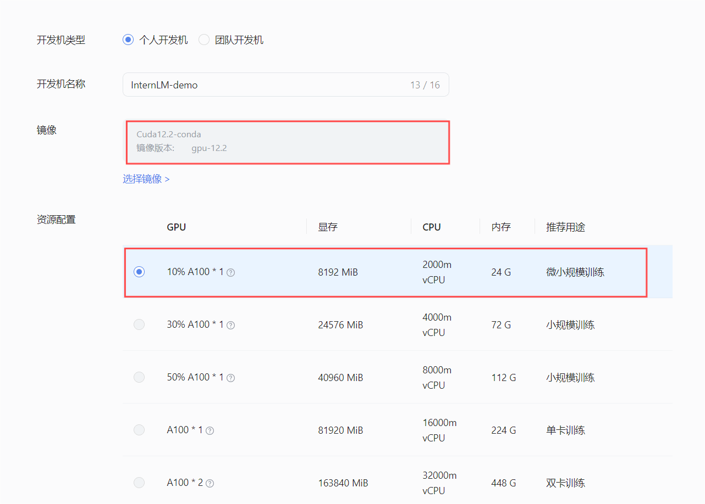
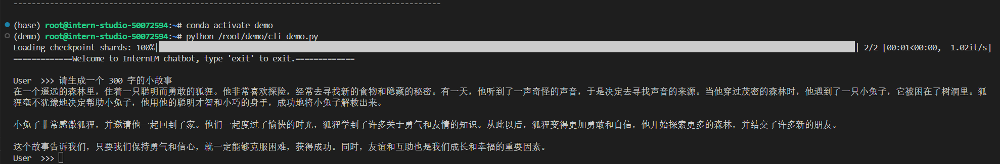
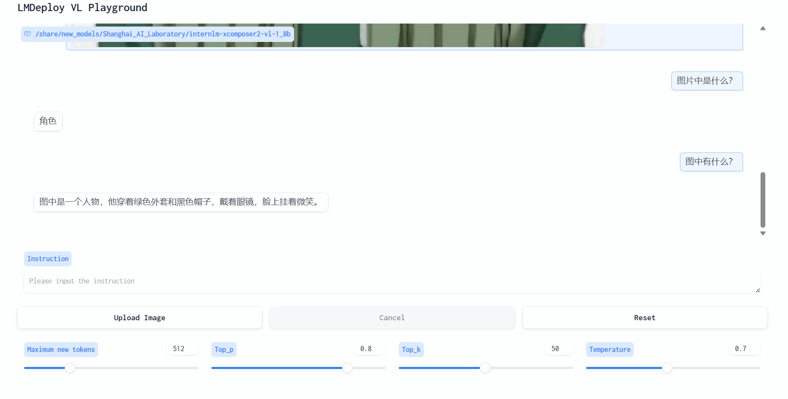
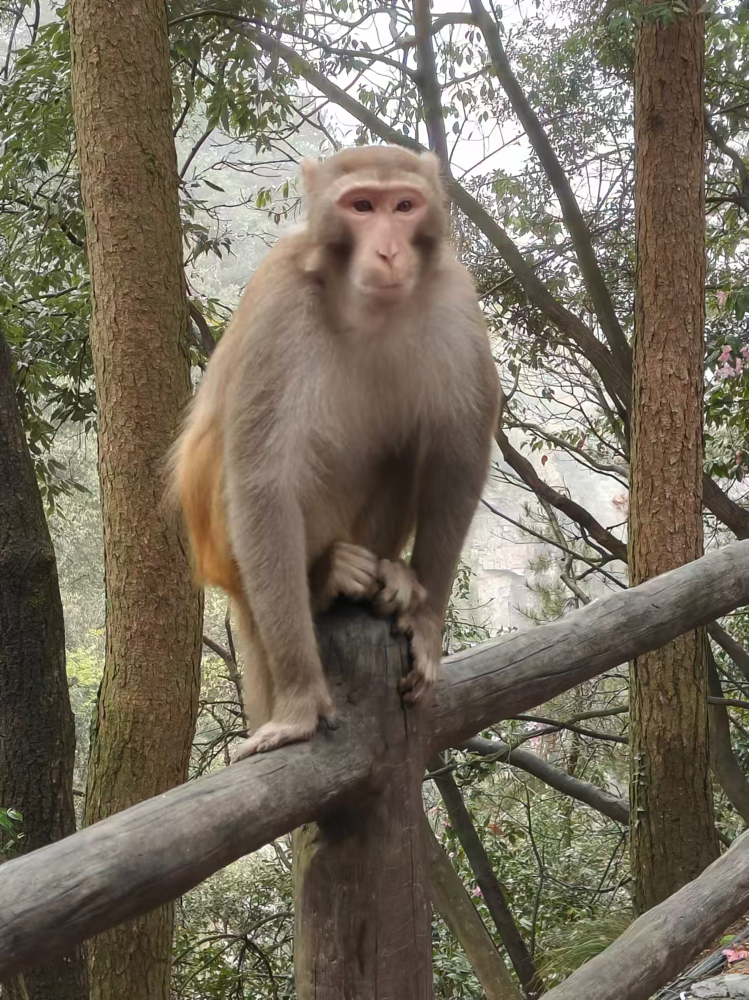
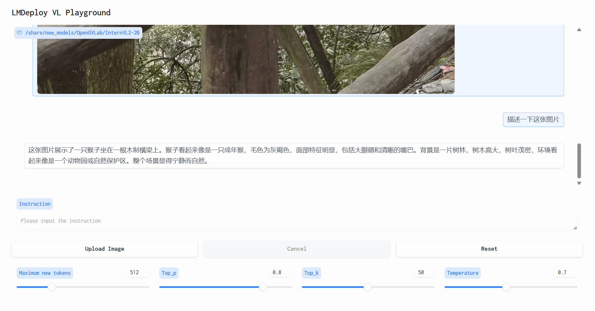

# Demo Task

### 基础任务 
使用 Cli Demo 完成 InternLM2-Chat-1.8B 模型的部署，并生成 300 字小故事

 - 在InternStudio控制台界面创建一个用于demo的开发机，镜像选择 Cuda12.2-conda 版本，GPU选择 10%A100 即可



 - 进入开发机，进行相关的环境配置

首先为Demo创建一个可用的环境

```bash
# 创建环境
conda create -n demo python==3.10 -y

# 激活环境
conda activate demo

# 安装 torch
conda install pytorch==2.1.2 torchvision==0.16.2 torchaudio==2.1.2 pytorch-cuda=12.1 -c pytorch -c nvidia -y

# 安装其他依赖
pip install transformers==4.38
pip install sentencepiece==0.1.99
pip install einops==0.8.0
pip install protobuf==5.27.2
pip install accelerate==0.33.0
pip install streamlit==1.37.0
```

然后在/root目录下创建demo文件夹，用于存放代码，并创建一个`cli_demo.py`文件。

```bash
mkdir -p /root/demo
touch /root/demo/cli_demo.py
```

将下面的代码复制到`cli_demo.py`文件中

```python
import torch
from transformers import AutoTokenizer, AutoModelForCausalLM


model_name_or_path = "/root/share/new_models/Shanghai_AI_Laboratory/internlm2-chat-1_8b"

tokenizer = AutoTokenizer.from_pretrained(model_name_or_path, trust_remote_code=True, device_map='cuda:0')
model = AutoModelForCausalLM.from_pretrained(model_name_or_path, trust_remote_code=True, torch_dtype=torch.bfloat16, device_map='cuda:0')
model = model.eval()

system_prompt = """You are an AI assistant whose name is InternLM (书生·浦语).
- InternLM (书生·浦语) is a conversational language model that is developed by Shanghai AI Laboratory (上海人工智能实验室). It is designed to be helpful, honest, and harmless.
- InternLM (书生·浦语) can understand and communicate fluently in the language chosen by the user such as English and 中文.
"""

messages = [(system_prompt, '')]

print("=============Welcome to InternLM chatbot, type 'exit' to exit.=============")

while True:
    input_text = input("\nUser  >>> ")
    input_text = input_text.replace(' ', '')
    if input_text == "exit":
        break

    length = 0
    for response, _ in model.stream_chat(tokenizer, input_text, messages):
        if response is not None:
            print(response[length:], flush=True, end="")
            length = len(response)

```

在终端中运行指令`python /root/demo/cli_demo.py`启动Demo。并让模型执行我们的指令，生成 300 字小故事。



### 进阶任务
使用 LMDeploy 完成 InternLM-XComposer2-VL-1.8B 的部署，并完成一次图文理解对话
使用 LMDeploy 完成 InternVL2-2B 的部署，并完成一次图文理解对话

-------------------

#### LMDeploy 部署 InternLM-XComposer2-VL-1.8B 模型

首先激活demo环境，安装LMDeploy和相关依赖

```bash
conda activate demo
pip install lmdeploy[all]==0.5.1
pip install timm==1.0.7
```

然后使用LMDeploy启动Gradio服务用于和InternLM-XComposer2-VL-1.8B模型交互

```bash
lmdeploy serve gradio /share/new_models/Shanghai_AI_Laboratory/internlm-xcomposer2-vl-1_8b --cache-max-entry-count 0.1
```


使用Upload Image上传图片，这里我们用咸鱼梦想家的照片来询问模型




---------------

#### LMDeploy 部署 InternVL2-2B 模型

 首先激活环境，然后使用命令来启动gradio服务用于和 InternVL2-2B 模型交互

 ```bash
conda activate demo
lmdeploy serve gradio /share/new_models/OpenGVLab/InternVL2-2B --cache-max-entry-count 0.1
 ```

完成端口映射后，通过浏览器访问 http://localhost:6006 来启动 Demo。

这里我们用用一张 monkey brother 的照片来询问模型





这里模型能够很好的识别出图片中的内容，还对环境做了分析，看来大佬们将模型调教的很好哇。

