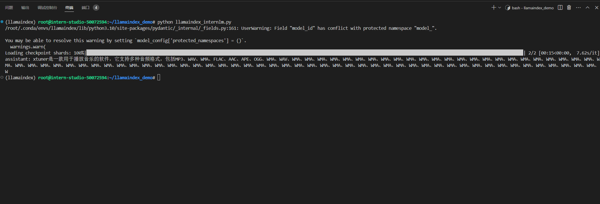
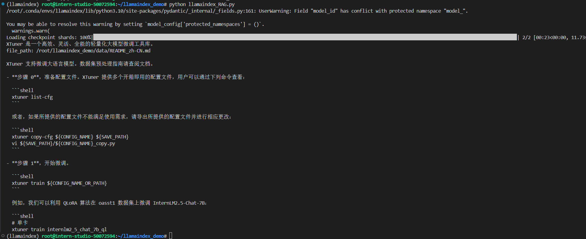

# Llamaindex RAG实践

**任务要求**

基于 LlamaIndex 构建自己的 RAG 知识库，寻找一个问题 A 在使用 LlamaIndex 之前InternLM2-Chat-1.8B模型不会回答，借助 LlamaIndex 后 InternLM2-Chat-1.8B 模型具备回答 A 的能力

- ### 首先创建cuda11.7-conda，30%A100的开发机

- ### 环境准备

    使用如下指令创建名为llamaindex的虚拟环境并下载相关依赖

    ```bash
    # 创建虚拟环境并激活
    studio-conda -t llamaindex -o pytorch-2.1.2
    conda activate llamaindex 
    # 下载依赖
    pip install llama-index==0.10.38 llama-index-llms-huggingface==0.2.0        "transformers[torch]==4.41.1" "huggingface_hub[inference]==0.23.1"  huggingface_hub==0.23.1  sentence-transformers==2.7.0 sentencepiece==0.2.0 
    pip install llama-index-embeddings-huggingface llama-index-embeddings-instructor
    ```

- ### 下载Sentence Transformer模型

    创建文件夹用于存放脚本，使用脚本下载源词向量模型

    ```bash
    cd ~
    mkdir llamaindex_demo
    mkdir model
    cd ~/llamaindex_demo
    touch download_hf.py
    ```

    打开`download_hf.py`文件粘贴下面的代码：

    ```python
    import os

    # 设置环境变量
    os.environ['HF_ENDPOINT'] = 'https://hf-mirror.com'

    # 下载模型
    os.system('huggingface-cli download --resume-download sentence-transformers/paraphrase-multilingual-MiniLM-L12-v2 --local-dir /root/model/sentence-transformer')
    ```

    在/root/llamaindex_demo目录下执行命令`python download_hf.py`,脚本即可开始下载源词向量模型

- ### 下载NLTK相关资源

    使用下面的命令将ntlk下载到开发机上并解压

    ```bash
    cd /root
    git clone https://gitee.com/yzy0612/nltk_data.git  --branch gh-pages
    cd nltk_data
    mv packages/*  ./
    cd tokenizers
    unzip punkt.zip
    cd ../taggers
    unzip averaged_perceptron_tagger.zip
    ```

- ### Llamaindex HuggingFaceLLM

    使用下面的指令将InternLM2-chat-1.8b软连接出来

    ```bash
    cd ~/model
    ln -s /root/share/new_models/Shanghai_AI_Laboratory/internlm2-chat-1_8b/ ./
    ```

    新建一个python文件用于测试使用RAG前模型的回答

    ```bash
    cd ~/llamaindex_demo
    touch llamaindex_internlm.py
    ```

    在`llamaindex_internlm.py`文件中粘贴以下代码

    ```python
    from llama_index.llms.huggingface import HuggingFaceLLM
    from llama_index.core.llms import ChatMessage
    llm = HuggingFaceLLM(
        model_name="/root/model/internlm2-chat-1_8b",
        tokenizer_name="/root/model/internlm2-chat-1_8b",
        model_kwargs={"trust_remote_code":True},
        tokenizer_kwargs={"trust_remote_code":True}
    )

    rsp = llm.chat(messages=[ChatMessage(content="xtuner是什么？")])
    print(rsp)
    ```

    使用命令`python llamaindex_internlm.py`运行

    

    发现回答的效果不好，不是我们想要的xtuner结果。

- ### Llamaindex RAG

    安装Llamaindex词嵌入向量依赖

    ```bash
    pip install llama-index-embeddings-huggingface llama-index-embeddings-instructor
    ```
    运行下面的命令获取知识库

    ```bash
    cd ~/llamaindex_demo
    mkdir data
    cd data
    git clone https://github.com/InternLM/xtuner.git
    mv xtuner/README_zh-CN.md ./
    ```

    新建一个python文件用于测试使用RAG后模型的效果

    ```bash
    cd ~/llamaindex_demo
    touch llamaindex_RAG.py
    ```

    在`llamaindex_RAG.py`中粘贴下面的代码

    ```python

    from llama_index.core import VectorStoreIndex, SimpleDirectoryReader, Settings

    from llama_index.embeddings.huggingface import HuggingFaceEmbedding
    from llama_index.llms.huggingface import HuggingFaceLLM

    #初始化一个HuggingFaceEmbedding对象，用于将文本转换为向量表示
    embed_model = HuggingFaceEmbedding(
    #指定了一个预训练的sentence-transformer模型的路径
        model_name="/root/model/sentence-transformer"
    )
    #将创建的嵌入模型赋值给全局设置的embed_model属性，
    #这样在后续的索引构建过程中就会使用这个模型。
    Settings.embed_model = embed_model

    llm = HuggingFaceLLM(
        model_name="/root/model/internlm2-chat-1_8b",
        tokenizer_name="/root/model/internlm2-chat-1_8b",
        model_kwargs={"trust_remote_code":True},
        tokenizer_kwargs={"trust_remote_code":True}
    )
    #设置全局的llm属性，这样在索引查询时会使用这个模型。
    Settings.llm = llm

    #从指定目录读取所有文档，并加载数据到内存中
    documents = SimpleDirectoryReader("/root/llamaindex_demo/data").load_data()
    #创建一个VectorStoreIndex，并使用之前加载的文档来构建索引。
    # 此索引将文档转换为向量，并存储这些向量以便于快速检索。
    index = VectorStoreIndex.from_documents(documents)
    # 创建一个查询引擎，这个引擎可以接收查询并返回相关文档的响应。
    query_engine = index.as_query_engine()
    response = query_engine.query("xtuner是什么?")

    print(response)
    ```

    运行`llamaindex_RAG.py`

    ```bash
    python llamaindex_RAG.py
    ```

    结果为

    

    这样模型就借助了RAG技术更新了xtuner的知识输出了我们想要的结果。