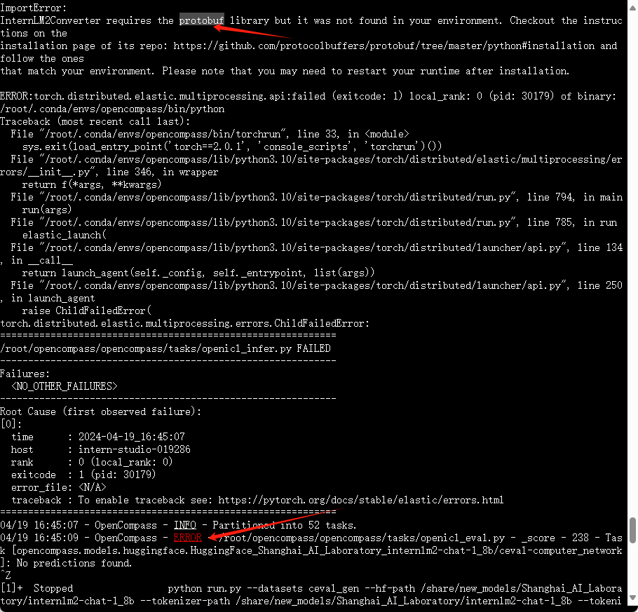
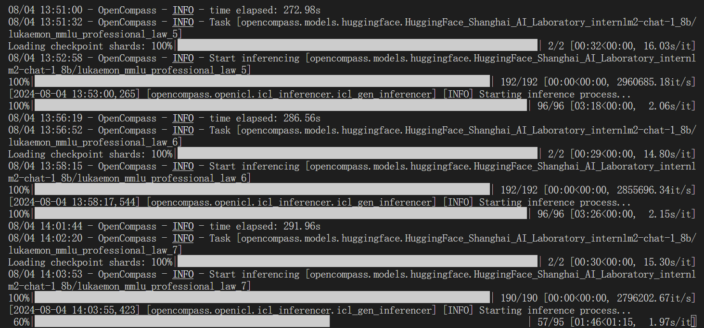
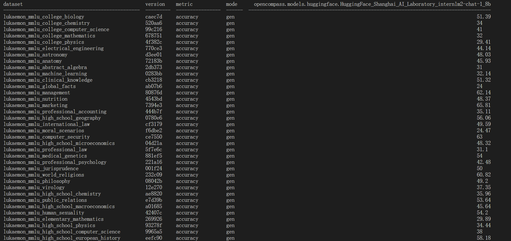
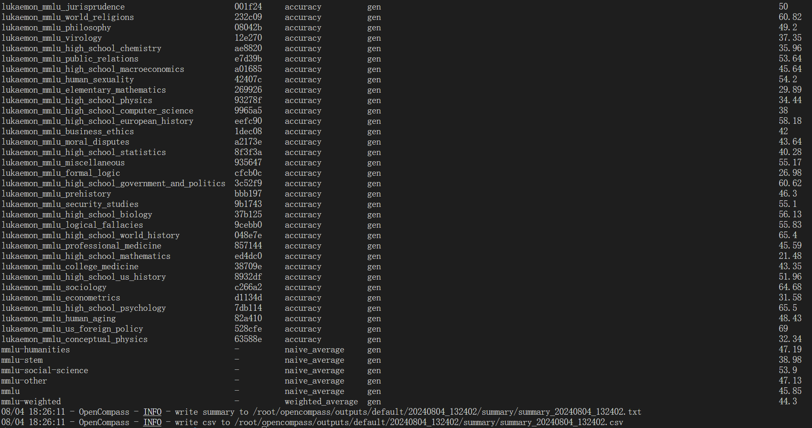
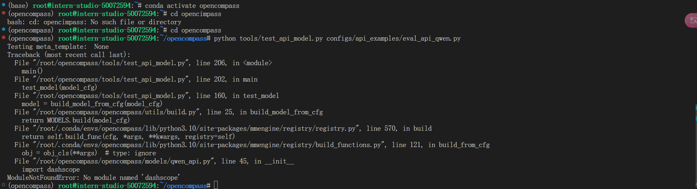
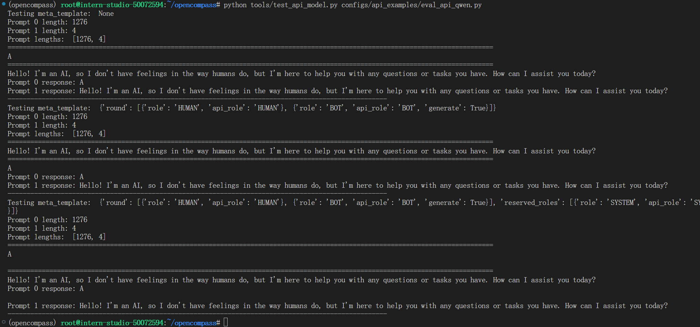

# OpenCompass 评测 InternLM-1.8B 实践

### 使用 OpenCompass 评测 internlm2-chat-1.8b 模型在 MMLU 数据集上的性能，记录复现过程并截图。

 首先创建cuda11.7-conda，10%A100的开发机，进入开发机后进行opencompass的环境配置

 ```bash
 #面向GPU的环境安装
studio-conda -o internlm-base -t opencompass
source activate opencompass
 
 #下载opencompass库并安装相关依赖
git clone -b 0.2.4 https://github.com/open-compass/opencompass
cd opencompass
pip install -e .           #注：-e后面有个点，表示当前目录
#pip install -e .指令可能会下载失败，可以用 pip install -r requirements.txt 
 ```

 然后解压数据集

 ```bash
 # 将本地数据集拷贝到opencompass目录下
cp /share/temp/datasets/OpenCompassData-core-20231110.zip /root/opencompass/
# 解压
unzip OpenCompassData-core-20231110.zip
 ```

 接着就可以通过命令开始评测MMLU数据集

 ```bash
python run.py --datasets mmlu_gen --hf-path /root/share/new_models/Shanghai_AI_Laboratory/internlm2-chat-1_8b --tokenizer-path /root/share/new_models/Shanghai_AI_Laboratory/internlm2-chat-1_8b --tokenizer-kwargs padding_side='left' truncation='left' trust_remote_code=True --model-kwargs trust_remote_code=True device_map='auto' --max-seq-len 1024 --max-out-len 16 --batch-size 2 --num-gpus 1 --debug
 ```

 **遇到错误：**

 

 使用`pip install protobuf`指令下载protobuf包即可解决

 **遇到错误:**

 mkl-service + Intel(R) MKL MKL_THREADING_LAYER=INTEL is incompatible with libgomp.so.1 ... 
 
 **解决方案：**

 ```bash
export MKL_SERVICE_FORCE_INTEL=1
#或
export MKL_THREADING_LAYER=GNU
 ```

 如果一切正常，终端页面会显示 “Starting inference process”，说明评测正在进行。

 

 运行结果

 

 

 评测需要大概需要8小时。

 ## 调用API使用opencompass测评

 以Qwen为例

 首先进入官网申请QwenAPI，初始有一定数量免费

https://dashscope.console.aliyun.com/apiKey


在`/root/opencompass/configs/api_examples/eval_api_qwen.py`中的key换成自己的api_key

执行下面的命令来评测

```bash
conda activate opencompass

cd opencompass

python tools/test_api_model.py configs/api_examples/eval_api_qwen.py
```

报错：`ModuleNotFoundError: No module named 'dashscope'`



解决办法：`pip install dashscope`

再执行命令`python tools/test_api_model.py configs/api_examples/eval_api_qwen.py`

结果



