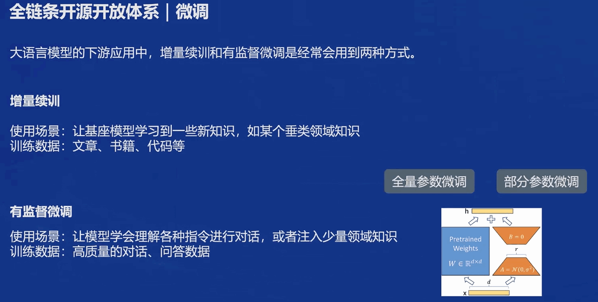
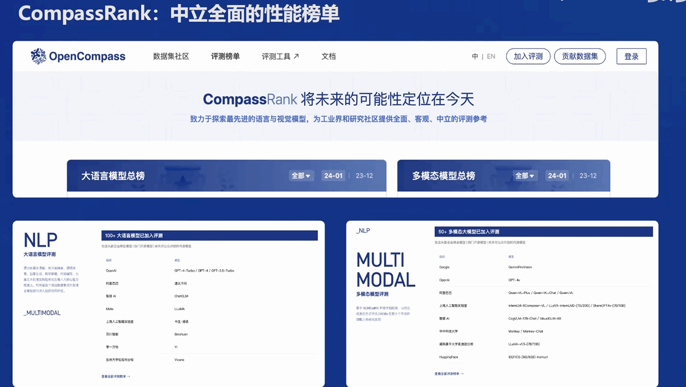

# 书生·浦语大模型全链路开源体系

## 大模型的发展之路和书生·浦语大模型的开源历程

自21世纪深度学习理论的突破以来，各类专用模型不断涌现并展现出出色的表现。针对特定的任务，一个模型解决一个问题的专用模型引发了人们的广泛关注。同时，让一个模型能够应对多种任务、多种模态的通过用大模型逐渐成为人工智能的发展趋势。

InternLM2开源模型有7B和20B两种规格，同时每个规格包含三个模型版本：
 - InternLM2-Base：高质量和具有很强可塑性的模型基座，是模型进行深度领域适配的高质量起点。
 - InternLM2：在Base的基础上，对多个能力方向进行了优化，在评测中成绩优异，同时保持了很好的通用语言能力，是推荐的在大部分应用中考虑选用的优秀基座模型。
 - InternLM2-Chat：在Base的基础上经过SFT和RLHF，面向对话交互进行了优化，具有很好的指令遵循、共情聊天和调用工具的能力。

**InternLM2回归语言建模的本质，使用新一代数据清洗过滤技术**
通过多维度数据价值评估、高质量语料驱动的数据富集和有针对性地数据补齐，提升模型下游任务的性能。

InternLM2的主要亮点：

 - 超长上下文：模型在20万token上下文中几乎完美的实现"大海捞针"
 - 综合性能全面提升：推理、数学、代码提升显著
 - 优秀的对话和创作体验：精准指令跟随、丰富的结构化创作
 - 工具调用能力整体提升：可靠支持工具多轮调用，复杂智能体搭建
 - 突出的数理能力和实用的数据分析功能：强大的内生计算能力，加入代码解释后能力进一步提升

## 从模型到应用-全链路开源体系

从模型到应用的典型流程

基于这些流程，书生浦语开源了全链条开放体系

 - 数据：书生·万卷覆盖多种模态与任务的2T数据
 - 预训练：开源的InternLM-Train支持并行训练和极致优化，训练速度达到3600 tokens/sec/gpu
 - 微调：XTuner开源框架支持全参数微调、Lora、QLora等低成本微调
 - 部署：LMDeploy全链路部署，性能领先，每秒生成2000+ tokens
 - 评测：OpenCompass全方位评测，性能可复现100套评测集、50万道题目
 - 应用：Lagent AgentLego支持多种智能体，支持代码解释器等多种工具

#### 数据
数据集地址: OpenDataLab https://opendatalab.org.cn/

#### 预训练

#### 微调
微调方式介绍

开源框架XTuner

#### 评测
OpenCompass开源之路

CompassRank中立全面的大模型性能榜单

CompassKit全栈工具链

CompassHub高质量评测基准社区

#### 部署
LMDeploy提供高效推理引擎、晚辈易用的工具链、支持交互式推理

相较于VLLM性能显著

#### 智能体
轻量级智能体框架Lagent

多模态智能体工具箱AgentLego

### 总结
书生全链路开源体系使得大模型更易于让非专业人员使用并走入生活，感谢上海人工智能实验室平台和书生社区每一位开发者的不懈努力。