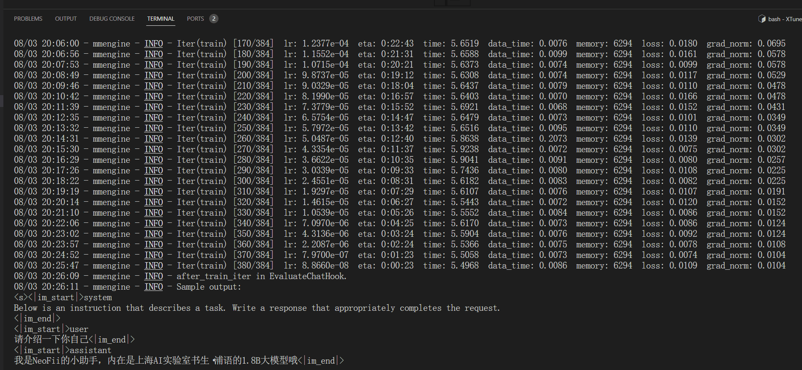
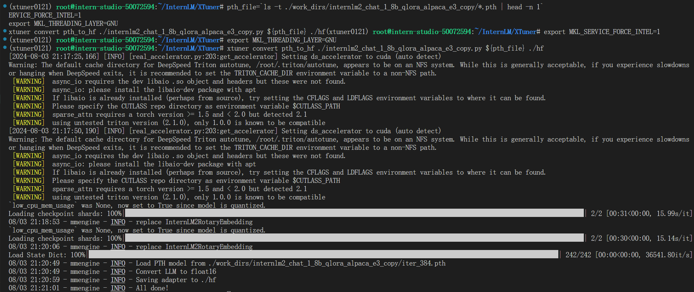
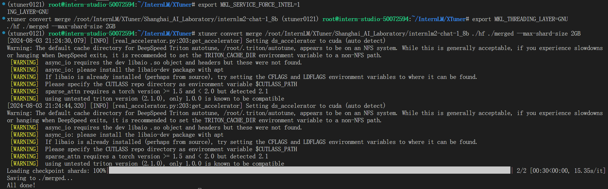
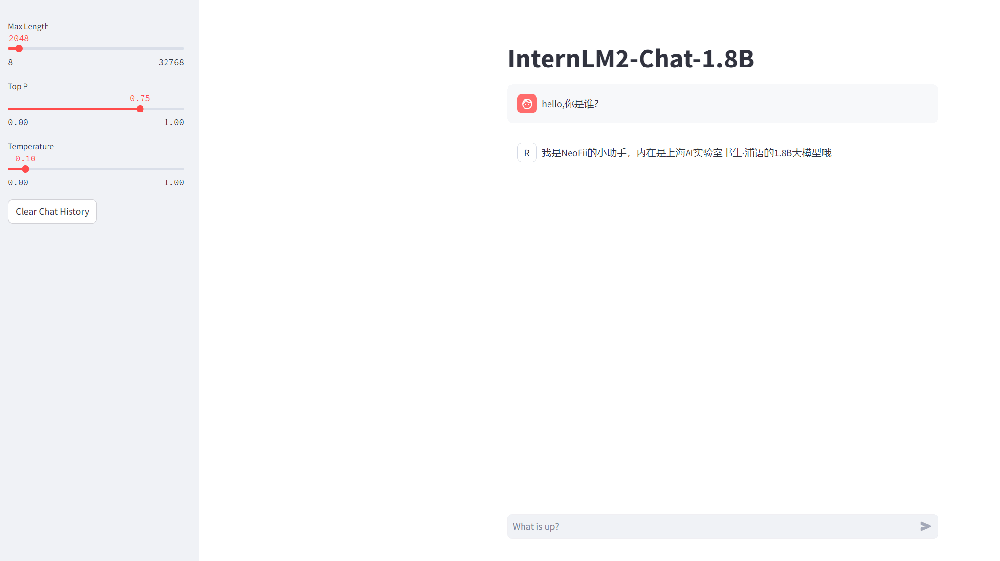

# XTuner微调个人小助手认知

 - 首先创建cuda12.2-conda，10%A100的开发机
 
 - 进入开发机后克隆Tutorial仓库到本地

 ```bash
mkdir -p /root/InternLM/Tutorial
git clone -b camp3  https://github.com/InternLM/Tutorial /root/InternLM/Tutorial
 ```

 - 创建名为xtuner0121的虚拟环境

 ```bash
# 创建虚拟环境
conda create -n xtuner0121 python=3.10 -y

# 激活虚拟环境（注意：后续的所有操作都需要在这个虚拟环境中进行）
conda activate xtuner0121

# 安装一些必要的库
conda install pytorch==2.1.2 torchvision==0.16.2 torchaudio==2.1.2 pytorch-cuda=12.1 -c pytorch -c nvidia -y
# 安装其他依赖
pip install transformers==4.39.3
pip install streamlit==1.36.0
 ```

 - 安装XTuner

 创建并进入虚拟环境后从GitHub上下载XTuner的源码

 ```bash
# 创建一个目录，用来存放源代码
mkdir -p /root/InternLM/code

cd /root/InternLM/code

git clone -b v0.1.21  https://github.com/InternLM/XTuner /root/InternLM/code/XTuner
 ```

 进入源码目录执行安装

 ```bash
# 进入到源码目录
cd /root/InternLM/code/XTuner
conda activate xtuner0121

# 执行安装
pip install -e '.[deepspeed]'
 ```

 - 模型准备

 使用InternLM2-1.8B-chat模型微调

 ```bash
# 创建一个目录，用来存放微调的所有资料，后续的所有操作都在该路径中进行
mkdir -p /root/InternLM/XTuner

cd /root/InternLM/XTuner

mkdir -p Shanghai_AI_Laboratory
# 软链接，将Shanghai_AI_Laboratory/internlm2-chat-1_8b链接指向/root/share/new_models/Shanghai_AI_Laboratory/internlm2-chat-1_8b
ln -s /root/share/new_models/Shanghai_AI_Laboratory/internlm2-chat-1_8b Shanghai_AI_Laboratory/internlm2-chat-1_8b
 ```

 - 指令跟随微调
     
     - 数据文件准备
     微调的目的是改变模型认知，需要准备一个模型自我认知的数据集用于训练，创建`datas/assistant.json`文件储存微调数据集。
     
     ```bash
     cd /root/InternLM/XTuner

    mkdir -p datas
    
    touch datas/assistant.json
     ```

     - 使用脚本生成数据

     ```bash
    cd /root/InternLM/XTuner

    touch xtuner_generate_assistant.py
     ```

     将以下内容写入脚本并保存
     
     ```python
    import json

    # 设置用户的名字
    name = '伍鲜同志'
    # 设置需要重复添加的数据次数
    n =  3750

    # 初始化数据
    data = [
        {"conversation": [{"input": "请介绍一下你自己", "output": "我是{}的小助手，内在是上     海AI实验室书生·浦语的1.8B大模型哦".format(name)}]},
        {"conversation": [{"input": "你在实战营做什么", "output": "我在这里帮助{}完成XTuner     微调个人小助手的任务".format(name)}]}
    ]

    # 通过循环，将初始化的对话数据重复添加到data列表中
    for i in range(n):
        data.append(data[0])
        data.append(data[1])

    # 将data列表中的数据写入到'datas/assistant.json'文件中
    with open('datas/assistant.json', 'w', encoding='utf-8') as f:
        # 使用json.dump方法将数据以JSON格式写入文件
        # ensure_ascii=False 确保中文字符正常显示
        # indent=4 使得文件内容格式化，便于阅读
        json.dump(data, f, ensure_ascii=False, indent=4)

     ```

     将第四行的`name`修改成自己的名称。

     然后执行脚本生成数据文件

     ```bash
    cd /root/InternLM/XTuner
    conda activate xtuner0121

    python xtuner_generate_assistant.py
     ```

     - 准备配置文件

     复制预设的配置文件

     ```bash
    cd /root/InternLM/XTuner
    conda activate xtuner0121

    xtuner copy-cfg internlm2_chat_1_8b_qlora_alpaca_e3 .
     ```

     对预设的配置文件进行修改

     ```python
    #######################################################################
    #                          PART 1  Settings                           #
    #######################################################################
    - pretrained_model_name_or_path = 'internlm/internlm2-chat-1_8b'
    + pretrained_model_name_or_path = '/root/InternLM/XTuner/Shanghai_AI_Laboratory/internlm2-chat-1_8b'

    - alpaca_en_path = 'tatsu-lab/alpaca'
    + alpaca_en_path = 'datas/assistant.json'

    evaluation_inputs = [
    -    '请给我介绍五个上海的景点', 'Please tell me five scenic spots in Shanghai'
    +    '请介绍一下你自己', 'Please introduce yourself'
    ]

    #######################################################################
    #                      PART 3  Dataset & Dataloader                   #
    #######################################################################
    alpaca_en = dict(
        type=process_hf_dataset,
    -   dataset=dict(type=load_dataset, path=alpaca_en_path),
    +   dataset=dict(type=load_dataset, path='json', data_files=dict(train=alpaca_en_path)),
        tokenizer=tokenizer,
        max_length=max_length,
    -   dataset_map_fn=alpaca_map_fn,
    +   dataset_map_fn=None,
        template_map_fn=dict(
            type=template_map_fn_factory, template=prompt_template),
        remove_unused_columns=True,
        shuffle_before_pack=True,
        pack_to_max_length=pack_to_max_length,
        use_varlen_attn=use_varlen_attn)
     ```

     修改完成后复制到当前目录

     ```bash
    cd /root/InternLM/XTuner
    cp /root/InternLM/Tutorial/configs/internlm2_chat_1_8b_qlora_alpaca_e3_copy.py ./
     ```

     - 启动微调

     ```txt
    xtuner train 命令用于启动模型微调进程。该命令需要一个参数：CONFIG 用于指定微调配置文件。 
    这里我们使用修改好的配置文件 internlm2_chat_1_8b_qlora_alpaca_e3_copy.py。
        
    训练过程中产生的所有文件，包括日志、配置文件、检查点文件、微调后的模型等，默认保存在   
    work_dirs 目录下，我们也可以通过添加 --work-dir 指定特定的文件保存位置
     ```

     ```bash
    cd /root/InternLM/XTuner
    conda activate xtuner0121

    xtuner train ./internlm2_chat_1_8b_qlora_alpaca_e3_copy.py
     ```

    训练结束后

    

 - 模型格式转换

 使用xtuner微调后的模型权重文件是pth格式，需要转换成通用的huggingface格式。使用下面的命令执行：

 ```bash
cd /root/InternLM/XTuner
conda activate xtuner0121

# 先获取最后保存的一个pth文件
pth_file=`ls -t ./work_dirs/internlm2_chat_1_8b_qlora_alpaca_e3_copy/*.pth | head -n 1`
export MKL_SERVICE_FORCE_INTEL=1
export MKL_THREADING_LAYER=GNU
xtuner convert pth_to_hf ./internlm2_chat_1_8b_qlora_alpaca_e3_copy.py ${pth_file} ./hf
 ```

 

 - 权重合并

 使用Lora微调的模型权重是额外的Adapter，需要与原模型合并。使用以下命令来完成权重合并：

 ```bash
cd /root/InternLM/XTuner
conda activate xtuner0121

export MKL_SERVICE_FORCE_INTEL=1
export MKL_THREADING_LAYER=GNU
xtuner convert merge /root/InternLM/XTuner/Shanghai_AI_Laboratory/internlm2-chat-1_8b ./hf ./merged --max-shard-size 2GB

 ```

 
 
 - 模型对话

 微调结束后通过`xtuner_streamlit_demo.py`脚本与模型对话观察微调后的对话效果。修改模型路径：

 ```python
# 直接修改脚本文件第18行
- model_name_or_path = "/root/InternLM/XTuner/Shanghai_AI_Laboratory/internlm2-chat-1_8b"
+ model_name_or_path = "/root/InternLM/XTuner/merged"
 ```

 - 启动应用

 ```bash
 conda activate xtuner0121

streamlit run /root/InternLM/Tutorial/tools/xtuner_streamlit_demo.py
```

