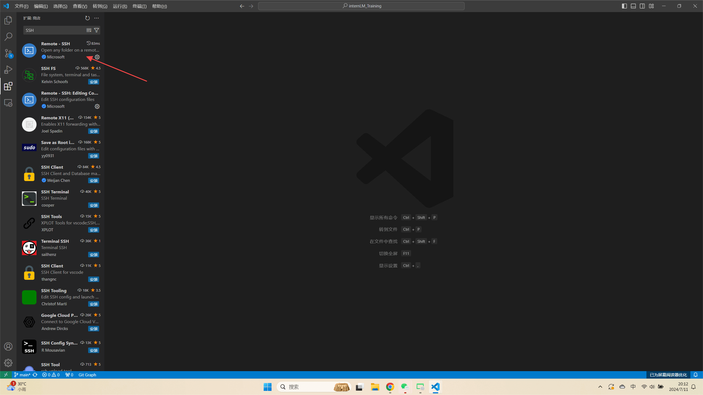
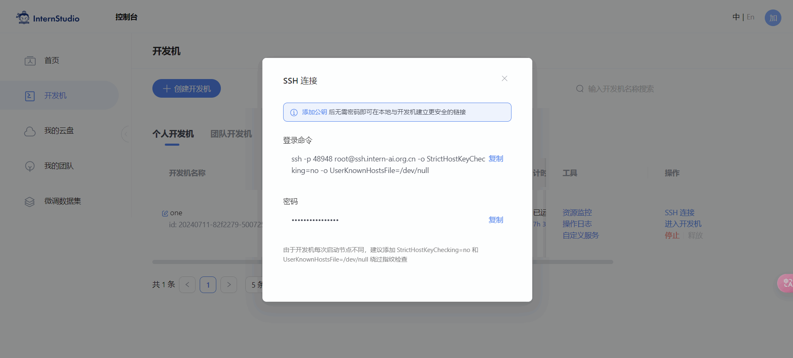
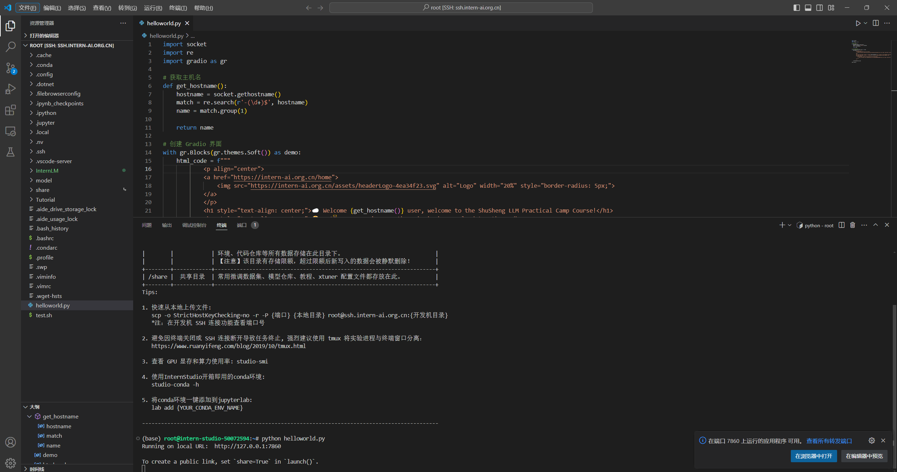
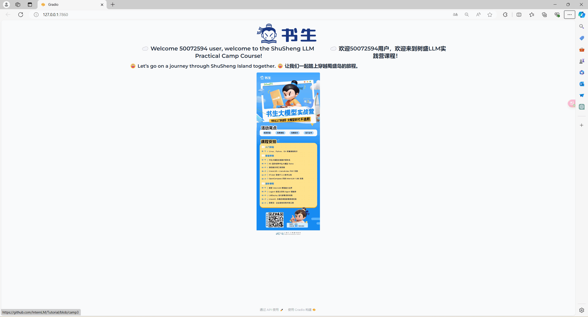
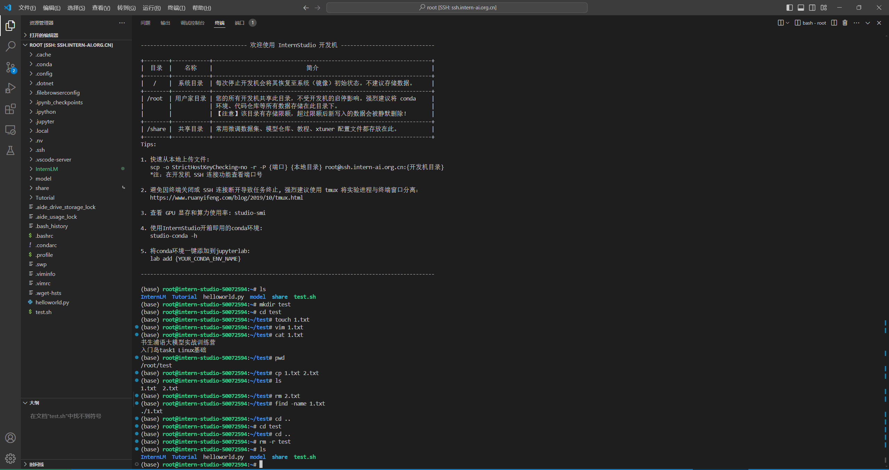
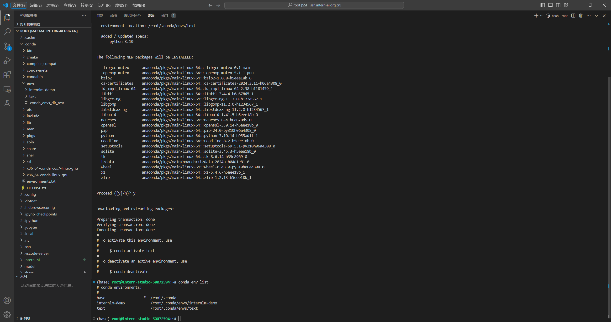
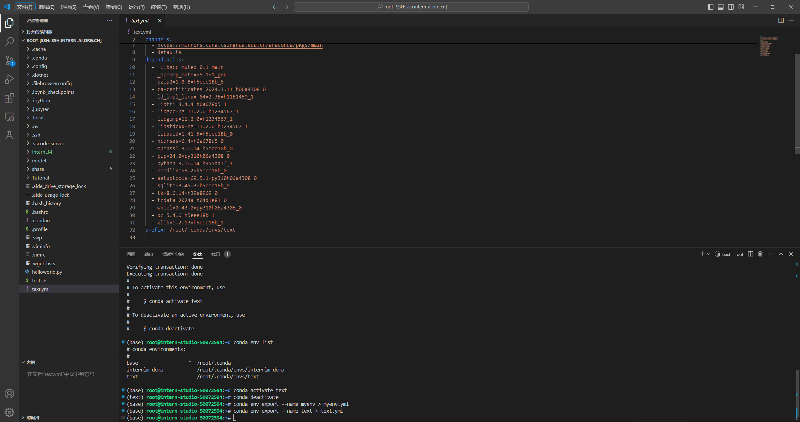
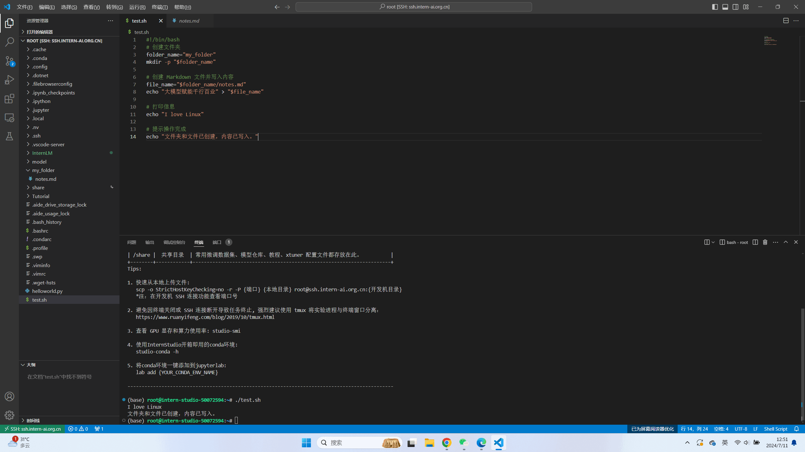
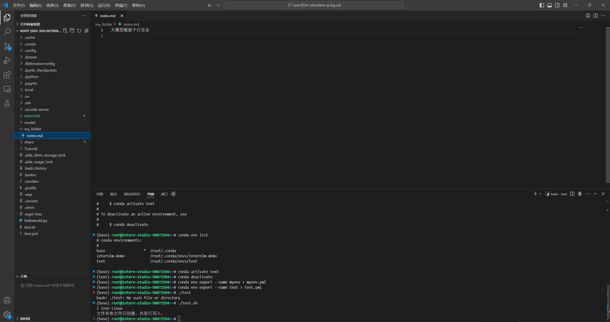

# Linux Task

## 1.完成SSH连接与端口映射并运行hello_morld.py
首先在VSCode扩展中下载SSH插件


在VSCode中添加SSH链接并复制开发机SSH连接中的登陆命令和登陆密码，即可在本地链接远程开发机。




internStudio开发及机界面选择自定义服务，并将相应的指令在本地VSCode中用连接远端开发机相同的步骤将端口映射到本地。


在本地创建helloworld.py文件
```python
import socket
import re
import gradio as gr
 
# 获取主机名
def get_hostname():
    hostname = socket.gethostname()
    match = re.search(r'-(\d+)$', hostname)
    name = match.group(1)
    
    return name
 
# 创建 Gradio 界面
with gr.Blocks(gr.themes.Soft()) as demo:
    html_code = f"""
            <p align="center">
            <a href="https://intern-ai.org.cn/home">
                
            </a>
            </p>
            <h1 style="text-align: center;">☁️ Welcome {get_hostname()} user, welcome to the ShuSheng LLM Practical Camp Course!</h1>
            <h2 style="text-align: center;">😀 Let’s go on a journey through ShuSheng Island together.</h2>
            <p align="center">
                <a href="https://github.com/InternLM/Tutorial/blob/camp3">
                    
                </a>
            </p>

            """
    gr.Markdown(html_code)

demo.launch()
```
终端中执行指令python helloworld.py运行文件。



在浏览器中打开网页



## 2.将Linux基础命令在开发机上完成一遍


## 3.使用 VSCODE 远程连接开发机并创建一个conda环境	
查看开发机中的虚拟环境使用下面的命令
```
conda env list
conda info -e
conda info --envs
```
创建虚拟环境
```
conda create -n text python=3.10 #创建了一个名为text的虚拟环境并指定python版本为3.10
```

激活与退出环境
```
conda activate text #激活text虚拟环境
conda deactivate text #退出text虚拟环境
```
删除与导出虚拟环境
```
conda remove --name name --all #删除名为name的虚拟环境
conda remove --name name package_name #删除name环境中的package_name包
```
导出环境
```
conda env export --name text > text.yml #获取名为text的虚拟环境所有配置并到处到文件text.yml中
conda env create -f text.yml #依据text.yml文件创建text虚拟环境，或还原text环境
```

## 4.创建并运行test.sh文件
使用shell脚本自动创建文件夹my_folder，并创建notes.md文件写入大模型赋能千行百业，完成后在终端提示：
```
I love Linux
文件夹和文件已创建，内容已写入。
```

创建test.sh文件并添加执行权限
```
chmod +x test.sh
```
执行命令


